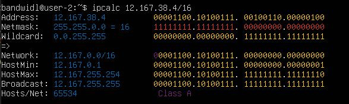
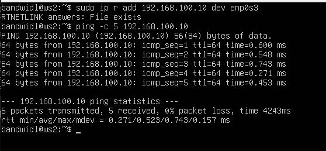
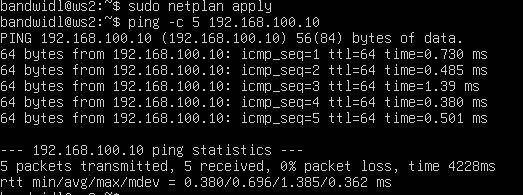

## Part 1. Инструмент **ipcalc**

**== Задание ==**

##### Подними виртуальную машину (далее -- ws1)

#### 1.1. Сети и маски
##### Определи и запиши в отчёт:
##### 1) Адрес сети *192.167.38.54/13*

- Командой `sudo apt install ipcalc` устанавливаем инструмент `ipcalc`
- Чтобы определить адрес сети используем команду `ipcalc 192.167.38.54/13`

*Результат выполнения команды `ipcalc 192.167.38.54/13`*

- Адрес сети записан в строчке `Network` - `192.160.0.0`

##### 2) Перевод маски *255.255.255.0* в префиксную и двоичную запись, */15* в обычную и двоичную, *11111111.11111111.11111111.11110000* в обычную и префиксную

*Результат выполнения команды `ipcalc 255.255.255.0`*

- Префиксная запись - `/24`
- Двоичная запись - `11111111.11111111.11111111.00000000`

*Результат выполнения команды `/15`*

- Обычная запись - `255.254.0.0`
- Двоичная запись - `11111111.11111110.00000000.00000000`

- Чтобы определить префиксную запись `11111111.11111111.11111111.11110000` считаем количество единиц - 28
- Префиксная запись `/28`

*Результат выполнения команды `/28`*

- Обычная запись - `255.255.255.240`

##### 3) Минимальный и максимальный хост в сети *12.167.38.4* при масках: */8*, *11111111.11111111.00000000.00000000*, *255.255.254.0* и */4*

*Результат выполнения команды `12.167.38.4/8`*

- Минимальный хост - `12.0.0.1`
- Максимальный хост `12.255.255.254`

- Переводим `11111111.11111111.00000000.00000000` в префиксную запись, считаем количество единиц - 16

*Результат выполнения команды `12.167.38.4/16`*

- Минимальный хост - `12.167.0.1`
- Максимальный хост `12.167.255.254`

*Результат выполнения команды `12.167.38.4/255.255.254.0`*

- Минимальный хост - `12.167.38.1`
- Максимальный хост `12.167.39.254`

*Результат выполнения команды `12.167.38.4/4`*

- Минимальный хост - `0.0.0.1`
- Максимальный хост `15.255.255.254`

#### 1.2. localhost
##### Определи и запиши в отчёт, можно ли обратиться к приложению, работающему на localhost, со следующими IP: *194.34.23.100*, *127.0.0.2*, *127.1.0.1*, *128.0.0.1*

- `localhost` (так называемый, «местный» от англ. local, или «локальный хост», по смыслу — этот компьютер) — в компьютерных сетях, стандартное, официально зарезервированное доменное имя для частных IP-адресов (в диапазоне 127.0.0.1 — 127.255.255.254). Соответственно можно обратиться к приложениям, IP адреса которых попадают в этот диапазон

- `194.34.23.100` - нельзя
- `127.0.0.2` - можно
- `127.1.0.1` - можно
- `128.0.0.1` - нельзя

#### 1.3. Диапазоны и сегменты сетей
##### Определи и запиши в отчёт:
##### 1) Какие из перечисленных IP можно использовать в качестве публичного, а какие только в качестве частных: *10.0.0.45*, *134.43.0.2*, *192.168.4.2*, *172.20.250.4*, *172.0.2.1*, *192.172.0.1*, *172.68.0.2*, *172.16.255.255*, *10.10.10.10*, *192.169.168.1*

- Частные адреса имеют диапазоны: 10.0.0.0 — 10.255.255.255, 100.64.0.0 — 100.127.255.255, 172.16.0.0 — 172.31.255.255, 192.168.0.0 — 192.168.255.255

- Частные адреса: `10.0.0.45`, `192.168.4.2`, `172.20.250.4`, `172.16.255.255`, `10.10.10.10`

- Публичные адреса: `134.43.0.2`, `172.0.2.1`, `192.172.0.1`, `172.68.0.2`, `192.169.168.1`

##### 2) Какие из перечисленных IP адресов шлюза возможны у сети *10.10.0.0/18*: *10.0.0.1*, *10.10.0.2*, *10.10.10.10*, *10.10.100.1*, *10.10.1.255*

*Результат выполнения команды `ipcalc 10.10.0.0/18`*

- Диапазон адресов для сети `10.10.0.1` - `10.10.63.255`
- `10.10.0.2`, `10.10.1.255`,`10.10.10.10` - могут быть адресами шлюза
- `10.0.0.1`, `10.10.100.1` - не могут быть адресами шлюза

## Part 2. Статическая маршрутизация между двумя машинами

**== Задание ==**

##### Подними две виртуальные машины (далее -- ws1 и ws2).

*Создаём `ws2`*

##### С помощью команды `ip a` посмотри существующие сетевые интерфейсы.

*Результат выполнения команды `ip a` для `ws1`*

*Результат выполнения команды `ip a` для `ws2`*

##### Опиши сетевой интерфейс, соответствующий внутренней сети, на обеих машинах и задать следующие адреса и маски: ws1 - *192.168.100.10*, маска */16*, ws2 - *172.24.116.8*, маска */12*.

- Интерфейс enp0s3 имеет IP-адрес 10.0.2.20 с маской /24 и является сетевым интерфейсом, соответствующим внутренней сети.

*Изменение файла `etc/netplan/00-installer-config.yaml` для `ws1`*

*Изменение файла `etc/netplan/00-installer-config.yaml` для `ws2`*

##### Выполни команду `netplan apply` для перезапуска сервиса сети.

*Применяем команду `netplan apply` и проверяем что изменения вступили в силу косандой `ip a` для `ws1`*

*Применяем команду `netplan apply` и проверяем что изменения вступили в силу косандой `ip a` для `ws2`*

#### 2.1. Добавление статического маршрута вручную
##### Добавь статический маршрут от одной машины до другой и обратно при помощи команды вида `ip r add`.
##### Пропингуй соединение между машинами.

- Добавляем статический маршрут от одной машины к другой командой `ip r add 172.24.116.8 dev enp0s3`
- Пингуем соединение командой с ограничением 5 пакетов командой `ping -c 5 172.24.116.8` 

*Вызов команд `ip r add 172.24.116.8 dev enp0s3` и `ping -c 5 172.24.116.8` для `ws1`*

- Добавляем статический маршрут от одной машины к другой командой `ip r add 192.168.100.10 dev enp0s3`
- Пингуем соединение командой с ограничением 5 пакетов командой `ping -c 5 192.168.100.10` 

*Вызов команд `ip r add 192.168.100.10 dev enp0s3` и `ping -c 5 192.168.100.10` для `ws2`*

#### 2.2. Добавление статического маршрута с сохранением
##### Перезапусти машины.

- Пререзапускаем машины командой `reboot`

##### Добавь статический маршрут от одной машины до другой с помощью файла */etc/netplan/00-installer-config.yaml*.

*Изменение файла `etc/netplan/00-installer-config.yaml` для `ws1`*

*Изменение файла `etc/netplan/00-installer-config.yaml` для `ws2`*

##### Пропингуй соединение между машинами.

*Вызов команд `netplan apply` и `ping -c 5 172.24.116.8` для `ws1`*

*Вызов команд `netplan apply` и `ping -c 5 192.168.100.10` для `ws2`*

## Part 3. Утилита **iperf3**

**== Задание ==**

#### 3.1. Скорость соединения
##### Переведи и запиши в отчёт: 8 Mbps в MB/s, 100 MB/s в Kbps, 1 Gbps в Mbps.

- 8 Mbps в MB/s:
- 8 Mbps * 0,125 MB/Mbps = 1 MB/s
- Результат: 8 Mbps = 1 MB/s

- 100 MB/s в Kbps:
- 100 MB/s = 100 * 1000 KB/s = 100000 KB/s
- 100000 KB/s * 8 бит = 800000 Kbps
- Результат: 100 MB/s = 800000 Kbps

- 1 Gbps в Mbps:
- Результат: 1 Gbps = 1000 Mbps

#### 3.2. Утилита **iperf3**
##### Измерь скорость соединения между ws1 и ws2.

- Командой `sudo apt install iperf3` устанавливаем утилиту на `ws1` и `ws2`

*На `ws1` вводим команду `iperf3 -s`, чтобы задать роль сервера*

*На `ws2` вводим команду `iperf3 -c 192.168.100.10`, чтобы задать роль клиента и узнать скорость соединения*

## Part 4. Сетевой экран

**== Задание ==**

#### 4.1. Утилита **iptables**
##### Создай файл */etc/firewall.sh*, имитирующий фаерволл, на ws1 и ws2:
##### Нужно добавить в файл подряд следующие правила:
##### 1) На ws1 примени стратегию, когда в начале пишется запрещающее правило, а в конце пишется разрешающее правило (это касается пунктов 4 и 5).
##### 2) На ws2 примени стратегию, когда в начале пишется разрешающее правило, а в конце пишется запрещающее правило (это касается пунктов 4 и 5).
##### 3) Открой на машинах доступ для порта 22 (ssh) и порта 80 (http).
##### 4) Запрети *echo reply* (машина не должна «пинговаться», т.е. должна быть блокировка на OUTPUT).
##### 5) Разреши *echo reply* (машина должна «пинговаться»).

- `-F` (flush) - этот флаг гарантирует, что все предыдущие правила будут удалены, и вы начнете с чистого листа при настройке фаерволла

- `-X` (delete-chain) - этот флаг гарантирует, что все пустые пользовательские цепочки будут удалены, что также помогает избежать конфликтов или несоответствий с новыми правилами

- Флаг `-A` означает `--append` и используется для добавления правила в конец указанной цепочки (в данном случае, цепочки INPUT или OUTPUT). Другими словами, он добавляет новое правило в конец цепочки правил файерволла

- Флаг `-p` означает `--protocol` и используется для указания протокола трафика, на который будет применяться правило. В примере, это TCP (tcp)

- Флаг `--dport` означает `--destination-port` и используется для указания порта назначения для пакетов данного правила. Например, `--dport 22` указывает на порт 22 (SSH) или `--dport 80` на порт 80 (HTTP)

- Флаг `-j` означает `--jump` и определяет действие, которое должно быть выполнено, если пакет соответствует текущему правилу. Например, ACCEPT для разрешения пакета, DROP для отбрасывания пакета и т.д.

- `--icmp-type echo-reply` - этот флаг указывает, что правило должно применяться только к ICMP-пакетам типа "echo reply". Это пакеты, используемые для ответа на пинг-запросы (ICMP echo requests). Когда устройство получает echo request (пинг-запрос), оно отправляет echo reply (пинг-ответ) в ответ. Если на устройстве заблокированы echo replies, другие устройства в сети не смогут получить ответы на их пинг-запросы, что делает устройство непингуемым.

*Содержание файла `/etc/firewall` для `ws1`*

*Содержание файла `/etc/firewall` для `ws2`*

##### Запусти файлы на обеих машинах командами `chmod +x /etc/firewall.sh` и `/etc/firewall.sh`.

*Выполнение команд `chmod +x /etc/firewall.sh` и `/etc/firewall.sh` для `ws1`*

*Выполнение команд `chmod +x /etc/firewall.sh` и `/etc/firewall.sh` для `ws2`*

- Разница между стратегиями:

- Стратегия ws1 (Сначала запрещающее правило, затем разрешающее правило):
- Описание: Сначала блокируются все пакеты, соответствующие определённым критериям, затем добавляются исключения для разрешённых случаев.
- Преимущества: Это обеспечивает более строгую началную политику безопасности, которая затем становится гибче за счёт добавления исключений. Это может быть удобнее для работы в условиях, где безопасность и контроль имеют высокий приоритет.

- Стратегия ws2 (Сначала разрешающее правило, затем запрещающее правило):
- Описание: Сначала разрешаются пакеты для определённых критериев, затем блокируются все остальные пакеты.
- Преимущества: Эта стратегия даёт возможность сразу задать разрешающие правила, что может быть полезно при необходимости быстро настроить работу критических сервисов, а потом заблокировать остальной трафик.

- В нашем случае применяется только первое правило (запрещаеющее для ws1 и разрешающее для ws2), а второе игнорируется

#### 4.2. Утилита **nmap**
##### Командой **ping** найди машину, которая не «пингуется», после чего утилитой **nmap** покажи, что хост машины запущен.

- Адрес `172.24.116.8` успешно пингуется

*Вызов команды `ping -c 5 172.24.116.8` для `ws1`*

- Адрес `192.168.100.10` не пингуется

*Вызов команд  `ping -c 5 192.168.100.10` и `nmap 192.168.100.10` для `ws2`*

##### Сохрани дампы образов виртуальных машин
**P.S. Ни в коем случае не сохраняй дампы в гит!**

## Part 5. Статическая маршрутизация сети

**== Задание ==**

##### Подними пять виртуальных машин (3 рабочие станции (ws11, ws21, ws22) и 2 роутера (r1, r2)).

*Поднимаем 5 виртуальных машин*

#### 5.1. Настройка адресов машин
##### Настрой конфигурации машин в *etc/netplan/00-installer-config.yaml* согласно сети на рисунке.

*Содержание файла `etc/netplan/00-installer-config.yaml` для `r1`*

*Содержание файла `etc/netplan/00-installer-config.yaml` для `r2`*

*Содержание файла `etc/netplan/00-installer-config.yaml` для `ws11`*

*Содержание файла `etc/netplan/00-installer-config.yaml` для `ws22`*

*Содержание файла `etc/netplan/00-installer-config.yaml` для `ws21`*

##### Перезапусти сервис сети. Если ошибок нет, то командой `ip -4 a` проверь, что адрес машины задан верно. Также пропингуй ws22 с ws21. Аналогично пропингуй r1 с ws11.

*Вызов команд `netplan apply` и `ip -4 a` для `r1`*

*Вызов команд `netplan apply` и `ip -4 a` для `r2`*

*Вызов команд `netplan apply` и `ip -4 a` для `ws11`*

*Вызов команд `netplan apply` и `ip -4 a` для `ws22`*

*Вызов команд `netplan apply` и `ip -4 a` для `ws21`*

*Вызов команды `ping -c 5 10.20.0.20` для `ws22`*

*Вызов команды `ping -c 5 10.10.0.1` для `ws11`*

#### 5.2. Включение переадресации IP-адресов
##### Для включения переадресации IP, выполни команду на роутерах:
`sysctl -w net.ipv4.ip_forward=1`

*Вызов команды `sysctl -w net.ipv4.ip_forward=1` для `r1`*

*Вызов команды `sysctl -w net.ipv4.ip_forward=1` для `r2`*

##### Открой файл */etc/sysctl.conf* и добавь в него следующую строку:
`net.ipv4.ip_forward = 1`

*Содержимое файла `/etc/sysctl.conf` для `r1`*

*Содержимое файла `/etc/sysctl.conf` для `r2`*

#### 5.3. Установка маршрута по-умолчанию

##### Настрой маршрут по-умолчанию (шлюз) для рабочих станций. Для этого добавь `default` перед IP роутера в файле конфигураций.

- В отчёт помести скрин с содержанием файла *etc/netplan/00-installer-config.yaml*;

*Содержимое файла `etc/netplan/00-installer-config.yaml` для `ws11`*

*Содержимое файла `etc/netplan/00-installer-config.yaml` для `ws22`*

*Содержимое файла `etc/netplan/00-installer-config.yaml` для `ws21`*

##### Вызови `ip r` и покажи, что добавился маршрут в таблицу маршрутизации.

*Вывод команды `ip r` для `ws11`*

*Вывод команды `ip r` для `ws22`*

*Вывод команды `ip r` для `ws21`*

##### Пропингуй с ws11 роутер r2 и покажи на r2, что пинг доходит. Для этого используй команду:
`tcpdump -tn -i eth0`

*На `r2` запускаем команду `tcpdump -tn -i enp0s8`*

*На `ws11` запускаем команду `ping -c 5 10.100.0.12`*

*На `r2` видим что пинг доходит*

#### 5.4. Добавление статических маршрутов
##### Добавь в роутеры r1 и r2 статические маршруты в файле конфигураций.

*Содержание файла `etc/netplan/00-installer-config.yaml` для `r1`*

*Содержание файла `etc/netplan/00-installer-config.yaml` для `r2`*

##### Вызови `ip r` и покажи таблицы с маршрутами на обоих роутерах.

*Вызов команд `sudo netplan apply` и `ip r` для `r1`*

*Вызов команд `sudo netplan apply` и `ip r` для `r2`*

##### Запусти команды на ws11:
`ip r list 10.10.0.0/[маска сети]` и `ip r list 0.0.0.0/0`

*Вызов команд `ip r list 10.10.0.0/18` и `ip r list 0.0.0.0/0` для `ws11`*

- В данном случае, для адреса 10.10.0.0/[маска сети] был выбран маршрут 10.10.0.0/[маска сети], потому что он более точный и имеет длинное совпадение по префиксу по сравнению с маршрутом по-умолчанию (0.0.0.0/0)
- Применение маршрута по-умолчанию произошло бы только если бы не существовало более специфичного маршрута для данного адреса назначения
- Этим выбором маршрутизатор обеспечивает оптимальный и корректный путь для пакетов на основе таблиц маршрутизации, что является ключевым аспектом эффективной работы сети

#### 5.5. Построение списка маршрутизаторов
##### Запусти на r1 команду дампа:
`tcpdump -tnv -i eth0`

*Запускаем команду `tcpdump -tnv -i enp0s9` на `r1`*

##### При помощи утилиты **traceroute** построй список маршрутизаторов на пути от ws11 до ws21.
- В отчёт помести скрины с вызовом и выводом использованных команд (tcpdump и traceroute);
- В отчёте, опираясь на вывод, полученный из дампа на r1, объясни принцип работы построения пути при помощи **traceroute**.

*Запускаем команду `traceroute 10.20.0.10` на `ws11`*

*Вывод команды `tcpdump -tnv -i enp0s9` на `r1`*

- Команда traceroute linux использует UDP пакеты. Она отправляет пакет с TTL=1 и смотрит адрес ответившего узла, дальше TTL=2, TTL=3 и так пока не достигнет цели. Каждый раз отправляется по три пакета и для каждого из них измеряется время прохождения. Пакет отправляется на случайный порт, который, скорее всего, не занят. Когда утилита traceroute получает сообщение от целевого узла о том, что порт недоступен трассировка считается завершенной

- Каждый пакет проходит на своем пути определенное количество узлов, пока достигнет своей цели. И, как мы уже знаем, каждый пакет имеет свое время жизни. Это количество узлов, которые может пройти пакет перед тем, как он будет уничтожен. Этот параметр записывается в заголовке TTL, каждый маршрутизатор, через который будет проходить пакет уменьшает его на единицу. При TTL=0 пакет уничтожается, а отправителю отсылается сообщение Time Exceeded

#### 5.6. Использование протокола **ICMP** при маршрутизации
##### Запусти на r1 перехват сетевого трафика, проходящего через eth0 с помощью команды:
`tcpdump -n -i eth0 icmp`
##### Пропингуй с ws11 несуществующий IP (например, *10.30.0.111*) с помощью команды:
`ping -c 1 10.30.0.111`

*Запускаем команду `ping -c 1 10.30.0.111` на `ws11`*

*Вывод команды `tcpdump -n -i enp0s8 icmp` на `r1`*

##### Сохрани дампы образов виртуальных машин.
**P.S. Ни в коем случае не сохраняй дампы в гит!**

## Part 6. Динамическая настройка IP с помощью **DHCP**

**== Задание ==**

##### Для r2 настрой в файле */etc/dhcp/dhcpd.conf* конфигурацию службы **DHCP**:
##### 1) Укажи адрес маршрутизатора по-умолчанию, DNS-сервер и адрес внутренней сети.

*Содержимое файла `/etc/dhcp/dhcpd.conf` на `r2`*

##### 2) В файле *resolv.conf* пропиши `nameserver 8.8.8.8`.

*Содержимое файла `resolv.conf`*

##### Перезагрузи службу **DHCP** командой `systemctl restart isc-dhcp-server`. Машину ws21 перезагрузи при помощи `reboot` и через `ip a` покажи, что она получила адрес. Также пропингуй ws22 с ws21.

*Вывод команды `systemctl restart isc-dhcp-server`*

*Вывод команды `ip a` на `ws21`*

*Вывод команды `ping -c 5 10.20.0.20`*

##### Укажи MAC адрес у ws11, для этого в *etc/netplan/00-installer-config.yaml* надо добавить строки: `macaddress: 10:10:10:10:10:BA`, `dhcp4: true`.

*Содержание файла `etc/netplan/00-installer-config.yaml` для `ws11`*

##### Для r1 настрой аналогично r2, но сделай выдачу адресов с жесткой привязкой к MAC-адресу (ws11). Проведи аналогичные тесты.

*Содержимое файла `/etc/dhcp/dhcpd.conf` на `r1`*

*Содержимое файла `resolv.conf`*

*Вывод команды `systemctl restart isc-dhcp-server`*

*Вывод команды `ip a` на `ws11`*

*Вывод команды `ping -c 5 10.10.0.1`*

*Вывод команды `ping -c 5 10.10.0.2`*

##### Запроси с ws21 обновление ip адреса.

*Вывод команды `ip a` на `ws21` до обновления*

*Командой `dhclient -r enp0s8` уничтожаем старый ip адрес*

*Командой `dhclient enp0s8` получаем новый ip адрес*

- Использованные опции `DHCP`:

- Опция `option routers` используется для указания шлюза по умолчанию (default gateway), который клиенты DHCP будут использовать для доступа к сетям за пределами их локальной сети. Обычно это IP-адрес маршрутизатора или любого другого устройства, которое выполняет роль шлюза в сети

- Опция `domain-name-servers` в DHCP используется для указания адресов DNS-серверов, которыми должны пользоваться клиенты, чтобы разрешать доменные имена

##### Сохрани дампы образов виртуальных машин.
**P.S. Ни в коем случае не сохраняй дампы в гит!**

## Part 7. **NAT**

**== Задание ==**

*В данном задании используются виртуальные машины из Части 5.*
##### В файле */etc/apache2/ports.conf* на ws22 и r1 измени строку `Listen 80` на `Listen 0.0.0.0:80`, то есть сделай сервер Apache2 общедоступным.

*Содержимое файла `/etc/apache2/ports.conf` на `r1`*

*Содержимое файла `/etc/apache2/ports.conf` на `ws22`*

##### Запусти веб-сервер Apache командой  на ws22 и r1.

*Вывод команды `service apache2 start` на `r1`*

*Вывод команды `service apache2 start` на `ws22`*

##### Добавь в фаервол, созданный по аналогии с фаерволом из Части 4, на r2 следующие правила:
##### 1) Удаление правил в таблице filter - `iptables -F`;
##### 2) Удаление правил в таблице "NAT" - `iptables -F -t nat`;
##### 3) Отбрасывать все маршрутизируемые пакеты - `iptables --policy FORWARD DROP`.
##### Запусти файл также, как в Части 4.
##### Проверь соединение между ws22 и r1 командой `ping`.

- При запуске файла с этими правилами, ws22 не должна «пинговаться» с r1

*Содержимое файла `/etc/firewall.sh`*

*Разрешаем исполнение файла командой `chmod +x /etc/firewall.sh` и запускаем командой `sh /etc/firewall.sh`*

*Вывод команды `ping -c 5 10.20.0.20`*

*Вывод команды `ping -c 5 10.100.0.11`*

##### Добавь в файл ещё одно правило:
##### 4) Разрешить маршрутизацию всех пакетов протокола **ICMP**.
##### Запусти файл также, как в Части 4.
##### Проверь соединение между ws22 и r1 командой `ping`.

- При запуске файла с этими правилами, ws22 должна «пинговаться» с r1

*Содержимое файла `/etc/firewall.sh`*

*Разрешаем исполнение файла командой `chmod +x /etc/firewall.sh` и запускаем командой `sh /etc/firewall.sh`*

*Вывод команды `ping -c 5 10.20.0.20`*

*Вывод команды `ping -c 5 10.100.0.11`*

##### Добавь в файл ещё два правила:
##### 5) Включи **SNAT**, а именно маскирование всех локальных ip из локальной сети, находящейся за r2 (по обозначениям из Части 5 - сеть 10.20.0.0).
##### 6) Включи **DNAT** на 8080 порт машины r2 и добавить к веб-серверу Apache, запущенному на ws22, доступ извне сети.

*Содержимое файла `/etc/firewall.sh`*

*Разрешаем исполнение файла командой `chmod +x /etc/firewall.sh` и запускаем командой `sh /etc/firewall.sh`*

##### Запусти файл также, как в Части 4.
##### Проверь соединение по TCP для **SNAT**: для этого с ws22 подключиться к серверу Apache на r1 командой:
`telnet [адрес] [порт]`

*Проверяем соединение командой `telnet 10.100.0.11 80`*

##### Проверь соединение по TCP для **DNAT**: для этого с r1 подключиться к серверу Apache на ws22 командой `telnet` (обращаться по адресу r2 и порту 8080).

*Проверяем соединение командой `telnet 10.100.0.12 8080`*

##### Сохрани дампы образов виртуальных машин.
**P.S. Ни в коем случае не сохраняй дампы в гит!**

## Part 8. Дополнительно. Знакомство с **SSH Tunnels**

**== Задание ==**

*В данном задании используются виртуальные машины из Части 5.*

##### Запусти на r2 фаервол с правилами из Части 7.

*Содержимое файла `/etc/firewall.sh`*

*Разрешаем исполнение файла командой `chmod +x /etc/firewall.sh` и запускаем командой `sh /etc/firewall.sh`*

##### Запусти веб-сервер **Apache** на ws22 только на localhost (то есть в файле */etc/apache2/ports.conf* измени строку `Listen 80` на `Listen localhost:80`).

*Содержимое файла `/etc/apache2/ports.conf` на `ws22`*

*Вывод команды `service apache2 start` на `ws22`*

##### Воспользуйся *Local TCP forwarding* с ws21 до ws22, чтобы получить доступ к веб-серверу на ws22 с ws21.

*Вывод команды ssh -L 8080:localhost:80 10.20.0.20*

*Вывод команды `telnet 127.0.0.1 8080`*

##### Воспользуйся *Remote TCP forwarding* c ws11 до ws22, чтобы получить доступ к веб-серверу на ws22 с ws11.
##### Для проверки, сработало ли подключение в обоих предыдущих пунктах, перейди во второй терминал (например, клавишами Alt + F2) и выполни команду:
`telnet 127.0.0.1 [локальный порт]`

*Вывод команды ssh -R 8080:localhost:80 10.10.0.2*

*Вывод команды `telnet 127.0.0.1 8080`*

##### Сохрани дампы образов виртуальных машин.
**P.S. Ни в коем случае не сохраняй дампы в гит!**
